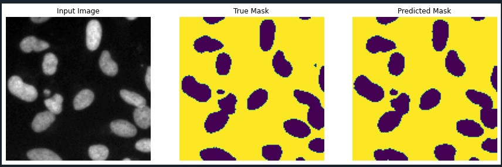

# Nuclei Cell Detection using Semantic Segmentation with U-Net

## 1. Objective
To create a model that can detect nuclei cell from biomedical images effectively. The nuclei cell vary in shapes and sizes, semantic segmentation proves to be the best approach to detect them.

## 2. Dataset
The dataset is obtained from [2018 Data Science Bowl dataset](https://www.kaggle.com/c/data-science-bowl-2018).

## 3. IDE and Framerowk
- <b>IDE<b>: Sypder
- <b>Frameworks<b>: Numpy, Matplotlib and Tensorflow, OpenCV and Scikit-learn

## 4. Methodology
The methodology is inspired by a documentation available in the official TensorFlow website. You can refer to the documentation [here](https://www.tensorflow.org/tutorials/images/segmentation).

### 4.1. Input Pipeline
The dataset contains a train folder for training data and test folder for testing data, in the format of images for inputs and image masks for the labels. The input images are preprocessed with feature scaling. The labels are preprocessed such that the values are in binary of 0 and 1. No data augmentation is applied for the dataset. The train data is split into train-validation sets, with a ratio of 80:20

### 4.2. Model Pipeline
The model architecture used for this project is U-Net. You can refer to the TensorFlow documentation for further details. In summary, the model consist of two components, the downward stack, which serves as the feature extractor, and upward stack, which helps to produce pixel-wise output. The model structure is shown in the figure below.


The model is trained with a batch size of 16 and 100 epochs. Early stopping is also applied in the model training. The training stops at epoch 22, with a training accuracy of 97% and validation accuracy of 96%. The model training graphs are shown in figures below.

 

The graphs show clearly the convergence of the model at an excellent convergence point.

## 5. Results
The model is evaluated with test data as shown in figure below.


Some predictions are also made with the model using some of the test data. The actual output masks and prediction masks are shown in figures below.




Overall, the model is capable of segmenting the cell nuclei with an excellent accuracy.

## 6. License
```
MIT License

Copyright (c) [year] [fullname]

Permission is hereby granted, free of charge, to any person obtaining a copy
of this software and associated documentation files (the "Software"), to deal
in the Software without restriction, including without limitation the rights
to use, copy, modify, merge, publish, distribute, sublicense, and/or sell
copies of the Software, and to permit persons to whom the Software is
furnished to do so, subject to the following conditions:

The above copyright notice and this permission notice shall be included in all
copies or substantial portions of the Software.

THE SOFTWARE IS PROVIDED "AS IS", WITHOUT WARRANTY OF ANY KIND, EXPRESS OR
IMPLIED, INCLUDING BUT NOT LIMITED TO THE WARRANTIES OF MERCHANTABILITY,
FITNESS FOR A PARTICULAR PURPOSE AND NONINFRINGEMENT. IN NO EVENT SHALL THE
AUTHORS OR COPYRIGHT HOLDERS BE LIABLE FOR ANY CLAIM, DAMAGES OR OTHER
LIABILITY, WHETHER IN AN ACTION OF CONTRACT, TORT OR OTHERWISE, ARISING FROM,
OUT OF OR IN CONNECTION WITH THE SOFTWARE OR THE USE OR OTHER DEALINGS IN THE
SOFTWARE.
```
